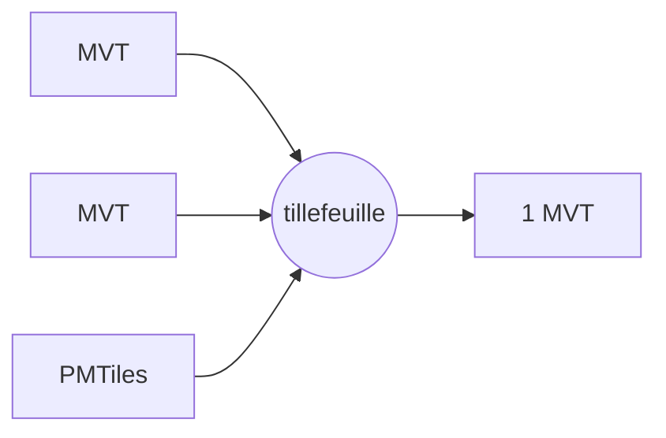

# tillefeuille

Merge multiple Mapbox Vector Tile (MVT) sources into a single prefixed,
multi-layer vector tile.

`tillefeuille` is a small, pure TypeScript library for composing vector tiles at
request time. Give it one tile coordinate and a set of source definitions, and it
fetches each source tile, prefixes every layer name with the source id, and
returns one merged MVT payload.



Its primary purpose is to run behind a server-side tile endpoint, such as a
Cloudflare Worker. The endpoint can fetch from multiple tile sources and return
one MVT to the client, so clients use a single tile source while the composition
stays on the server. `tillefeuille` is designed to be embedded in that service;
it does not ship an HTTP server.

## Features

- Merge multiple MVT sources into one MVT response.
- Prefix layer names as `<source-id>:<original-layer-name>` to avoid collisions.
- Fetch tiles from HTTP(S) URL templates using `{z}`, `{x}`, and `{y}` tokens.
- Read PMTiles v3 archives over HTTP range requests.
- Accept gzip-compressed source tiles.
- Optionally return gzip-compressed output.
- Use Web-standard APIs such as `fetch`, `AbortSignal`, `CompressionStream`, and
  `DecompressionStream`.

## Installation

```sh
pnpm add tillefeuille
```

## Usage

```ts
import { mergeVectorTiles } from "tillefeuille";

const tile = await mergeVectorTiles({
  z: 14,
  x: 14553,
  y: 6451,
  sources: {
    basemap: "https://example.com/basemap/{z}/{x}/{y}.mvt",
    roads: "https://example.com/roads/{z}/{x}/{y}.mvt",
    poi: "https://example.com/poi/{z}/{x}/{y}.mvt",
    admin: "pmtiles://https://example.com/admin.pmtiles"
  }
});

return new Response(tile, {
  headers: {
    "content-type": "application/vnd.mapbox-vector-tile"
  }
});
```

By default, the returned `Uint8Array` is an uncompressed MVT. Set
`outputCompression: "gzip"` when you want a gzip-compressed response body:

```ts
const tile = await mergeVectorTiles({
  z,
  x,
  y,
  sources,
  outputCompression: "gzip"
});

return new Response(tile, {
  headers: {
    "content-type": "application/vnd.mapbox-vector-tile",
    "content-encoding": "gzip"
  }
});
```

## API

### `mergeVectorTiles(options)`

```ts
import { mergeVectorTiles } from "tillefeuille";

const tile: Uint8Array = await mergeVectorTiles(options);
```

Options:

| Option | Type | Description |
| --- | --- | --- |
| `z` | `number` | Tile zoom level. |
| `x` | `number` | Tile column. |
| `y` | `number` | Tile row. |
| `sources` | `Record<string, string>` | Source ids mapped to HTTP tile URL templates or PMTiles archive URLs. |
| `fetch` | `typeof fetch` | Optional custom fetch implementation. Useful for tests and runtimes with wrapped fetch behavior. |
| `signal` | `AbortSignal` | Optional abort signal passed to source requests. |
| `outputCompression` | `"none" \| "gzip"` | Output compression. Defaults to uncompressed output. |
| `skipMissing` | `boolean` | Whether to ignore missing source tiles. Defaults to `true`. |

Missing source tiles are HTTP `404`, HTTP `204`, or absent PMTiles entries. When
`skipMissing` is `true`, they are omitted from the merged tile. When
`skipMissing` is `false`, a missing source tile throws an error.

## Source URLs

HTTP sources must start with `http://` or `https://` and include all three tile
coordinate tokens:

```ts
{
  roads: "https://tiles.example.com/roads/{z}/{x}/{y}.mvt"
}
```

PMTiles sources use the `pmtiles://` prefix followed by the archive URL:

```ts
{
  admin: "pmtiles://https://tiles.example.com/admin.pmtiles"
}
```

For PMTiles sources, the archive server must support HTTP range requests.

## Layer Naming

Every output layer is renamed using the source id:

```text
<source-id>:<original-layer-name>
```

For example, if the `roads` source contains a layer named `transportation`, the
merged tile contains that layer as:

```text
roads:transportation
```

This keeps layer names stable and prevents collisions when different source
tiles contain layers with the same name.

## Runtime Requirements

`tillefeuille` targets modern JavaScript runtimes with Web-standard APIs:

- `fetch`
- `Response`
- `Headers`
- `AbortSignal`
- `DecompressionStream` for gzip source tiles
- `CompressionStream` for gzip output

It is intended for runtimes such as modern Node.js, Cloudflare Workers, and other
Fetch-compatible environments.

## Local Demo

```sh
pnpm run demo
```

The demo builds the library and starts a Vite app that uses MapLibre GL JS. It
registers a custom protocol that calls `mergeVectorTiles`, inspects the merged
tile, and renders layers by geometry type. It exists for debugging and
explanation only; production deployments should compose tiles in a server-side
endpoint such as a Cloudflare Worker.

The same demo is deployed to GitHub Pages when `main` is pushed:

https://kanahiro.github.io/tillefeuille/demo/

## Development

```sh
pnpm install
pnpm run build
pnpm test
```

Before publishing, `pnpm pack` and `pnpm publish` run the `prepack` script,
which builds the package and runs the test suite.

## License

MIT
